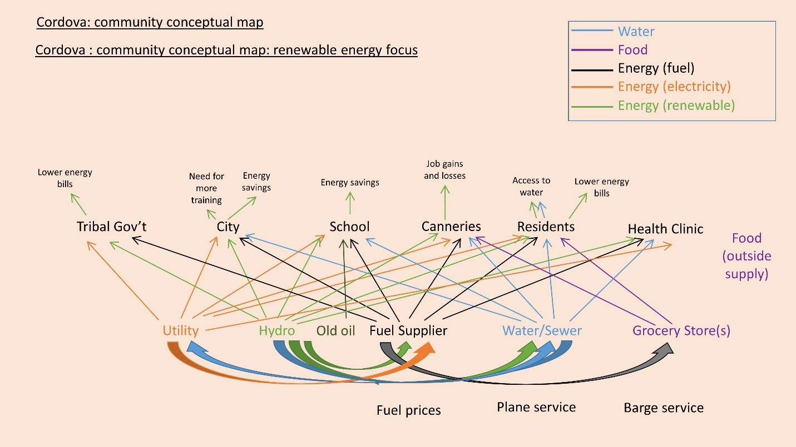
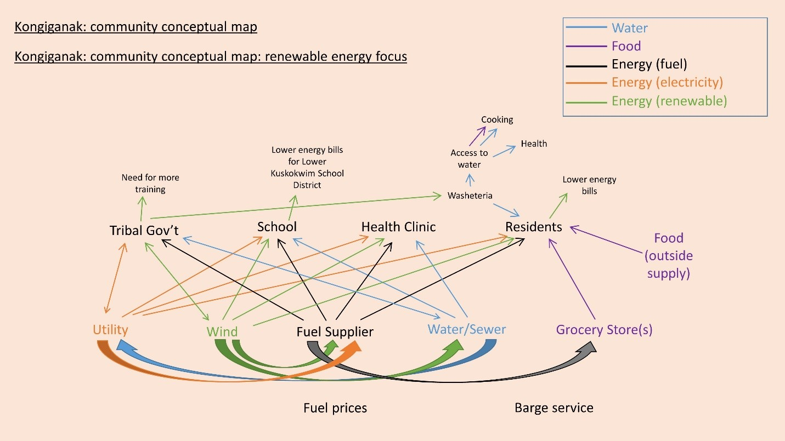
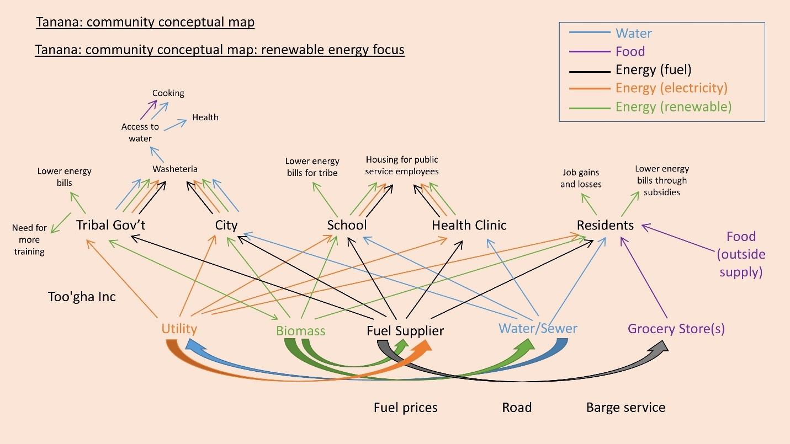

<form action="https://mjc55.github.io/MicroFEWs_Legacy/" align="center" style="bold">
<input type="submit" value="<b>Back to Main Page<\b>" />
</form>

<table style="border-collapse: collapse; border: none;">
  <tr width="100%" style="border: none;">
    <th width="400" style="border: none;"> <form action="https://mjc55.github.io/MicroFEWs_Legacy/Objectives/Objective_2" align="center"><input type="submit" value="Objective 2" /></form> </th>
    <th width="400" style="border: none;"> <form action="https://mjc55.github.io/MicroFEWs_Legacy/Objectives/Objective_3" align="center"><input type="submit" value="Objective 3" /></form>  </th>
    <th width="400" style="border: none;"> <form action="https://mjc55.github.io/MicroFEWs_Legacy/Objectives/Objective_4" align="center"><input type="submit" value="Objective 4" /></form> </th>
    <th width="400" style="border: none;"> <form action="https://mjc55.github.io/MicroFEWs_Legacy/Objectives/Objective_5" align="center"><input type="submit" value="Objective 5" /></form> </th>
    <th width="400" style="border: none;"> <form action="https://mjc55.github.io/MicroFEWs_Legacy/Objectives/Objective_6" align="center"><input type="submit" value="Objective 6" /></form> </th>
  </tr>
</table>

# Objective 1: Stakeholder Developement of the FEW Framework

## Lead
Jennifer Schmidt  
jischmidt0@gmail.com

## Research Question

 
How do communities currently understand and prioritize feedbacks among food, water, and energy at the local level, and what are the existing and potential infrastructure components that influence FEW security?
   
Local residents’ tacit understanding of the structure and function of their social-ecological systems are widely recognized as having value for both diagnosing current challenges and in planning for future scenarios. We will engage community stakeholders in development and refinement of localized FEW system models. Community-Based Participatory Research (CBPR) is a collaborative research approach that focuses on social, structural and physical environmental issues through the active involvement of community members and researchers in all aspects of the research process.

 
## Purpose
 

 
Engaging communities early in research projects is a necessary step to establishing credibility, developing more equitable roles, developing appropriate research methods, and producing knowledge that advances both science and society. Local community members and researchers will work together to ensure engagement in the proposed research, in the design and planning of the research, and in data collection and analysis, with the goal to produce results that define issues of local relevance and to identify strategies the improve local capacity to effectively respond to change.

 
## Actions
 

 
We will work with communities to design a framework correlating community FEW security to optimization of food and water related infrastructure in a renewable-powered grid. We will identify linkages among food, water, and energy, elucidate real-world trade-offs residents may make to meet their FEW needs, determine metrics desirable to researchers and the community, and assess culturally relevant ways to collect such data. Specifically, we will engage community experts (i.e. utility managers, store owners, tribal leaders, freight agents, etc.) in a collaborative exercise to create a set of conceptual diagrams for local food, water, and energy system

 

| Goals | Status |
|---   |---  |
| Identify community energy leaders and energy stakeholder advisory board	| Completed |
| Host kickoff meeting at Decision Theater North	| Completed |
| Schedule initial community meetings	| Completed |
| Identify on-grid or off-grid existing and desired infrastructure components impacting local FEW nexus	| Completed |
| Compile conceptual maps, to be made available for the community and stakeholder advisory board	| Completed |
| Document and prioritize FEW linkages and feedbacks, trade-offs, and needs	| Completed |
| Develop informative FEW security and usage metrics, and identify culturally appropriate methods to capture them	| Completed |

## Highlights

### Infographics

<table style="border-collapse: collapse; border: none;">
  <tr width="100%" style="border: none;">
    <th width="400" style="border: none;"> <embed src="solar_infographic.pdf" width="230px" height="600px" /> 
<a href="Objectives/Objective_1/solar_infographic.pdf">Solar PV Infographic</a> 
  </th>
    <th width="400" style="border: none;"> <embed src="windturbines_infographic.pdf" width="230px" height="600px" /> 
<a href="Objectives/Objective_1/windturbines_infographic.pdf">Wind Turbine Infographic</a>
  </th>
    <th width="400" style="border: none;"> <embed src="hydro_infographic.pdf" width="230px" height="600px" /> 
<a href="Objectives/Objective_1/hydro_infographic.pdf">Hydropower Infographic</a>
  </th>
  </tr>
</table>

### Publications

* ["Stoking the Flame: Subsistence and wood energy in rural Alaska, United States"](Objectives/Objective_1/schmidt-et-al-2021-biomass-tanana-subsistence.pdf) by Jennifer I. Schmidt, Amanda Byrd, Jennifer Curl, Todd J. Brinkman, Krista Heeringa. Energy Research & Social Science 71 (2021)

* ["Food, Energy & Water"](microfewsreport_foodenergywater_august2020-2.pdf) Community Report, August 2020

* ["Renewable Energy"](microfewscommunityreport_re_july62020.pdf) Community Report, July 2020
* ["MicroFEWs – A Food-Energy-Water (FEW) Systems Approach to Renewable Energy Decisions in Islanded Microgrid Communities in Rural Alaska"](https://www.liebertpub.com/doi/10.1089/ees.2019.0055) by Whitney E., Aggarwal S., Huang D., Wies R.W., Huntington H.P., Schmidt J.I., Dotson A.D., Karenzi J., Environmental Engineering Science, July 2019
* Dr. Richard Wies talks about MicroFEWs at the 2018 AGU Fall Meeting
  

  <iframe width="400" height="200" src="https://www.youtube.com/embed/gEZQeBnrdHY" title="YouTube video player" frameborder="0" allow="accelerometer; autoplay; clipboard-write; encrypted-media; gyroscope; picture-in-picture" allowfullscreen></iframe>
  

* ["Planting the Seeds to Examine Food Security Challenges in the Alaska Food-Energy-Water Nexus"](afpc_final_03072019.pdf), Presentation at Alaska Food Policy Council, March 2019
* Literature review of FEW research and the FEW nexus
* Presentation in Tanana: "Renewable Energy, Community, and Culture: Tanana, Alaska," October 2018
* Heating Fuel Use Data – first year results
* Hosted kick-off workshop at UAF in April 2018
* Visits to Kongiganak, Tanana, and Cordova in March 2018

### Additional Content

<object data="solar_infographic.pdf" type="application/pdf" width="700px" height="700px">
    <embed src="solar_infographic.pdf">
        
This browser does not support PDFs. Please download the PDF to view it: <a href="http://yoursite.com/the.pdf">Download PDF</a>.

    </embed>
</object>

### Conceptual Models

