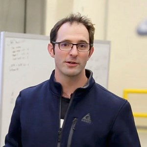

<form action="https://mjc55.github.io/MicroFEWs_Legacy/" align="center">
<input type="submit" value="Back to Main Page" />
</form>

# MicroFEWs Team

    <b>Erin Whitney</b>   
    Principal Investigator (PI)  
    Alaska Center for Energy and Power   
    erin.whitney@alaska.edu   

 

"The MicroFEWS project is a unique opportunity to quantify the effects of current and future renewable energy generation on measurable food and water outcomes in Alaska communities.  I'm excited to be working with these communities and to hear their input and feedback on these connections."

---

    <b>Richard Wies</b>   
    Co-Principal Investigator (co-PI)  
    University of Alaska Fairbanks  
    rwwiesjr@alaska.edu   
    Project components: Energy Distribution Models (Objective 4)  

 

 
"Past experiences have shown that proper integration of renewable energy systems in remote Alaska communities is critical for maintaining reliable electricity and heat which translates to reliable food and water systems. Using energy as a lens in this project we hope to better understand and predict how renewable energy would impact food, energy, and water security in these remote communities."

---

    <b>Srijan Aggarwal</b>   
    Co-Principal Investigator (co-PI)  
    University of Alaska Fairbanks, College of Engineering and Mines  
    saggarwal@alaska.edu   
    Project components: Modular Systems (Objective 3)   

 

"Food, Energy, and Water are inextricably linked and it is about time we look at the system holistically than just trying to tackle the parts. I am excited to explore this uncharted territory with a diverse team of Alaskan community members, researchers, and beyond."

---

    <b>Daisy Huang</b>   
    Co-Principal Investigator (co-PI)  
    Alaska Center for Energy and Power   
    dhuang@alaska.edu   
    Project components: Community Data and Synthesis (Objectives 2 and 5)   

 

 
"This is the first team I've ever worked with that has such a diversity of skills and backgrounds. I'm grateful to play a role in helping communities remain healthy, happy, sustainable, and resilient!"

---

    <b>Henry Huntington</b>   
    Huntington Consulting, Eagle River, Alaska  
    shenryphuntington@gmail.com    
    Project components: FEW Framework and Synthesis (Objectives 1 and 5)   

 

"Rural Alaska residents are adept at innovating. If we can join them in applying those skills to food, energy, and water, then together we can do a lot to improve people's lives around the state and beyond."

---

    <b>Henry Harry Penn</b>   
    Arctic Institute of North America, University of Calgary   
    henry.penn@ucalgary.ca   
    Project components: Modular Systems (Objective 3)   

 

 
"This project is working on diverse challenges with an equally diverse group of researchers, scientists, communities, and community members. It offers a wealth of opportunity to develop some truly innovative and important outcomes. I'm very happy to be able to play a role."

---

    <b>Barbara Johnson</b>   
    Graduate Student, University of Alaska Fairbanks  
    Project components: Modular Systems (Objective 3)   

 
 

"I am excited to be part of the MicroFEWs project, and work with and learn from a team of people with a fantastic range of expertise and experience, such as tribal government members, city councillorsand academics."

---

    <b>Christopher Pike</b>   
    Alaska Center for Energy and Power  
    cpike6@alaska.edu   
    Project components: Community Data and Modular Systems (Objectives 2 and 3)   

 

 
"Developing a better understanding of the relationship between food, water, and energy consumption is important to develop a more holistic understanding of Alaska's islanded communities."

---

    <b>Daniel Sambor</b>   
    Stanford University  
    dsambor@stanford.edu  
    Project components: Modular Systems (Objective 3)   

 

"Since growing up on a small Midwestern farm, I have been keenly aware of relationships between food, energy, and water systems. The ability to formally study this nexus with an expert team in innovative Alaskan communities is a rewarding experience I am excited to be a part of."

---

    <b>Jennifer Schmidt</b>   
    Co-Principal Investigator (co-PI)  
    University of Alaska Anchorage  
    jischmidt0@gmail.com   
    Project components: FEW Framework, Community Data, and Synthesis (Objectives 1, 2, and 5)   

 

 
"Food, water, and energy are issues that people can relate to and are important. By looking at all three we have the opportunity to study a real life and relatable situation."

---

    <b>Bill Schnabel</b>   
    Institute of Northern Engineering   
    weschnabel@alaska.edu  
    Project components: FEW Framework and Syntehsis (Objectives 1 and 5)   

 

"Speaking as somebody who focused on water in school, this idea of looking at food, water, and energy as an integrated system is an exciting concept. I think this approach makes a lot of sense for rural Alaska, and I look forward to hearing what rural Alaska has to say about it."

---

    <b>Justus Karenzi</b>   
    Graduate Student, University of Alaska Fairbanks  
    Project components: Modular Systems and Energy Distribution Models (Objectives 3 and 4)   

 
 

 
"Hoping to understand the impacts of renewable energy technologies on the complex interactions within the FEW infrastructure systems in rural Alaska."

---

    <b>Michelle Wilber</b>   
    Research Engineer, Alaska Center for Energy & Power   
    Project components: Community Data and Modular Systems (Objective 2 and 3)   

 
 

---

    <b>Aaron Dotson</b>   
    University of Alaska Anchorage, Interim Vice Provost for Research & Director, Applied Environmental Research Center  
    addotson@alaska.edu  
    Project components: Modular Systems (Objective 3)   

---

    <b>Michele Chamberlin</b>   
    University of Alaska Fairbanks, Alaska Center for Energy and Power  
    mjchamberlin2@alaska.edu  
    Project components: Modular Systems (Objective 3)   

---

    <b>Murad Rashedin</b>   
    University of Alaska Anchorage, Interim Vice Provost for Research & Director, Applied Environmental Research Center  
    mrashedin@alaska.edu  
    Project components: Modular Systems (Objective 3)   

---

    <b>Grace Bolt</b>   
    University of Alaska Fairbanks, Alaska Center for Energy and Power  
    gbolt@alaska.edu  
    Project components: Modular Systems (Objective 3)   

---

    <b>Chong Her</b>   
    University of Alaska Fairbanks, Alaska Center for Energy and Power  
    cher6@alaska.edu  
    Project components: Modular Systems (Objective 3)   

---

<form action="https://mjc55.github.io/MicroFEWs_Legacy/" align="center">
<input type="submit" value="Back to Main Page" />
</form>

